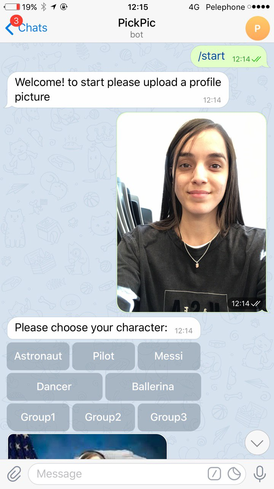
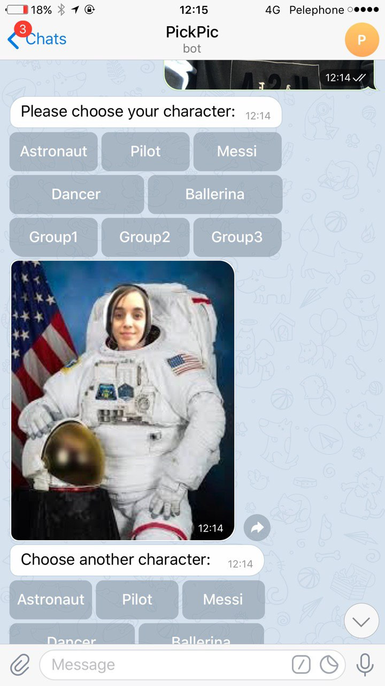
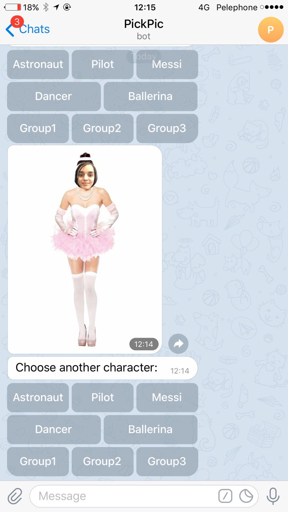

# 👮‍♂️👩‍🎓PickPic👷‍♂️🕵️‍♂️👨‍🎓
<https://t.me/PickPic_Maneger_bot>

Paste a picture on funny image

* Izak Hirschman
* Yehonatan Menachem
* Lital Zilka

{OPTIONAL: MORE PROJECT INFO HERE}

## Screenshots

## How to Run This Bot
### Prerequisites
* Python 3.7 or 3.8
* pipenv
* {ADD MORE DEPENDENCIES HERE - FOR EXAMPLE MONGODB OR ANYTHING ELSE}

### Setup
* Clone this repo from github
* Install dependencies: `pipenv install`
* Get a BOT ID from the [botfather](https://telegram.me/BotFather).
* Create a `secrets.py` file:

        BOT_TOKEN = "your-bot-token-here"

### Run
To run the bot use:

    pipenv run python bot.py

### Running tests
First make sure to install all dev dependencies:

    pipenv install --dev

To run all test  use:

    pipenv run pytest

(Or just `pytest` if running in a pipenv shell.)

## Credits and References
https://stackoverflow.com/questions/51486297/cropping-an-image-in-a-circular-way-using-python _ stackoverflow-make image round
https://towardsdatascience.com/face-detection-in-2-minutes-using-opencv-python-90f89d7c0f81 _ face recognition with open_cv
* [Telegram Docs](https://core.telegram.org/bots)
* [python-telegram-bot](https://github.com/python-telegram-bot/python-telegram-bot)
* {ADD MORE REFERENCES TO LIBRARIES, APIS AND CODE SNIPPETS HERE}
